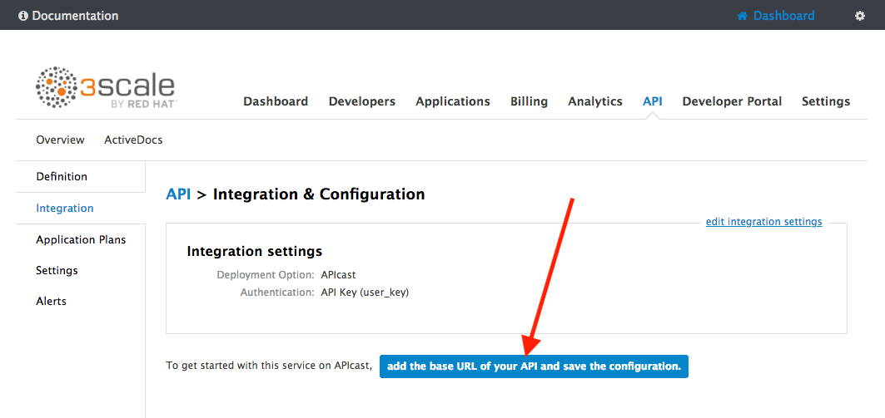
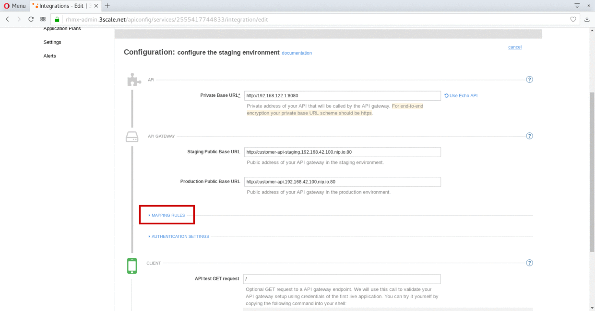
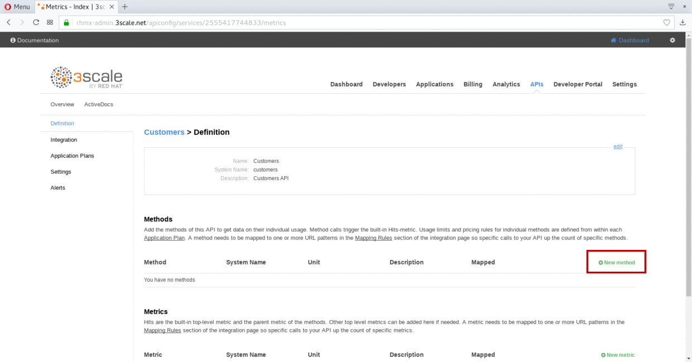
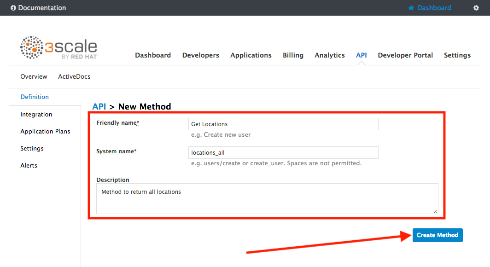
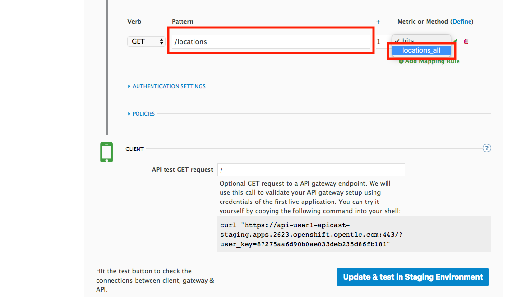
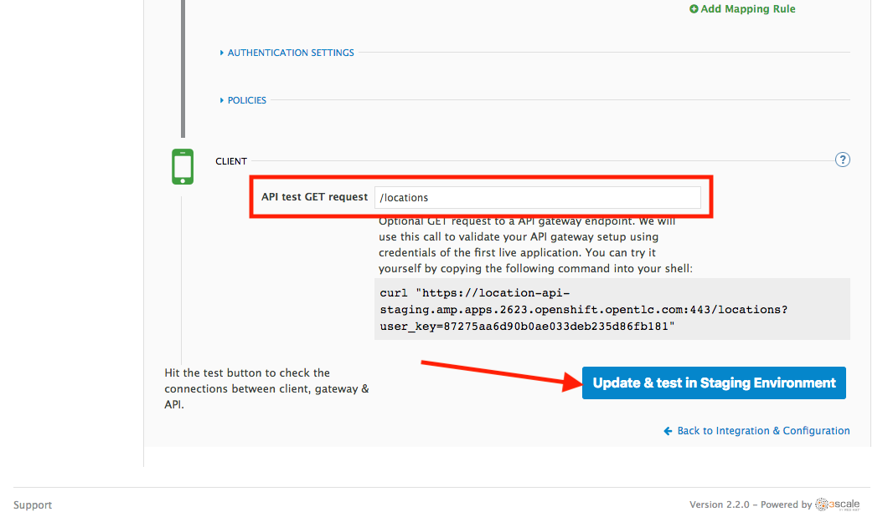
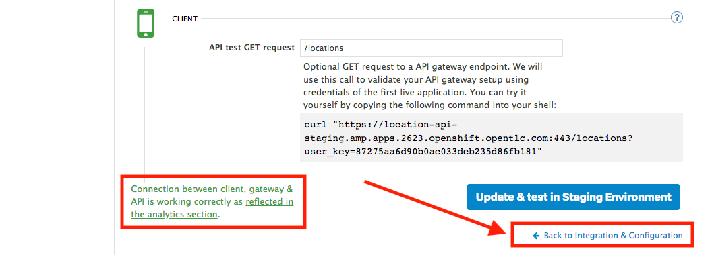
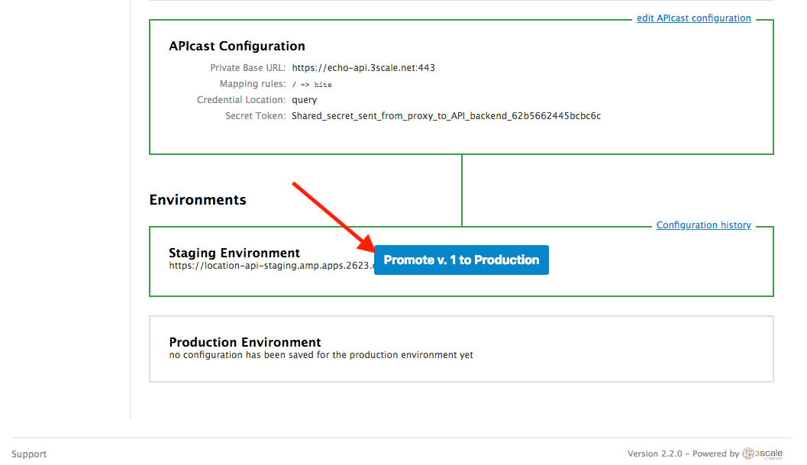

# Lab 3

## API Management

### Take control of your APIs

* Duration: 30 mins
* Audience: API Owners, Product Managers, Developers, Architects

## Overview

> Describe the general idea of the lab and what is the attendant going to learn.

### Why Red Hat?

> Add the keypoints why the attendant will find value using Red Hat products.

### Skipping The Lab

We know sometime we don't have enough time to go over step by step on the labs. So here is a [short video](wip-link) where you can see how to configure your service using Red Hat 3scale API Management.

If you are planning to follow to the next lab, there is an already running API proxy for the Location API Service in this endpoint:

```bash
http://location-service-api.amp.apps.GUID.openshiftworkshop.com
```

### Environment

**URLs:**

Check with your instruction the *GUID* number of your current workshop environment. Replace the actual number on all the URLs where you find **GUID**.

Example in case of *GUID* = **1234**:

```bash
https://master.GUID.openshiftworkshop.com
```

becomes =>

```bash
https://master.1234.openshiftworkshop.com
```

**Credentials:**

Your username is your asigned user number. For example, if you are assigned user number **1**, your username is: 

```bash
user1
```

The password to login is always the same:

```bash
r3dh4t1!
```

## Lab Instructions

### Step 1: Define your API Proxy

Your 3scale Admin Portal provides access to a number of configuration features.

1. Open a browser window and navigate to:

    ```bash
    https://userX-admin.apps.GUID.openshiftworkshop.com/
    ```

    *Remember to replace the GUID with your [environment](#environment) value and your user number.*

1. Accept the self-signed certificate if you haven't.

    

1. Log into 3scale using your designated [user and password](#environment). Click on **Sign In**.

    

1. The first page you will land is the *API Management Dashboard*. Click on the **API** menu link.

    

1. This is the *API Overview* page. Here you can take an overview of all your services. Click on the **Integration** link.

    

1. Click on the **edit integration settings** to edit the API settings for the gateway.

    

1. Keep select the **APIcast** deployment option in the *Gateway* section.

    

1. Scroll down and keep the **API Key (user_key)** Authentication.

    

1. Click on **Update Service**.

1. Click on the **add the Base URL of your API and save the configuration** button

    

1. Scroll down and expand the **mapping rules** section to define the allowed methods on our exposed API.

    *The default mapping is the root ("/") of our API resources, something that we might want to avoid*.

    

1. Click on the **Metric or Method (Define)**  link.

    

1. Click on the **New Method** link in the *Methods* section.

    

1. Fill in the information for your Fuse Method.

    * Friendly name: **Get Locations**

    * System name: **locations_all**

    * Description: **Method to return all locations**

    

1. Click on **Create Method**.

1. Click on the **Add mapping rule** link

    

1. Click on the edit icon next to the GET mapping rule.

    

1. Type in the *Pattern* text box the following: 

    ```bash
    /locations
    ```

1. Select **locations_all** as Method from the combo box.

    


1. Scroll back to the top of the page. Fill in the information for accessing your API:

    * Private Base URL: **http://camel-ose-springboot-xml:80**

    * Staging Public Base URL: **https://location-api-staging.amp.apps.GUID.openshiftworkshop.com:443**

    * Production Public Base URL: **https://location-api.amp.apps.GUID.openshiftworkshop.com:443**

    *Remember to replace the GUID with your [environment](#environment) value*.

    *We are using the internal API service, as we are deploying our services inside the same OpenShift cluster*.

    

1. Scroll down to the **API Test GET request**.

1. Type in the textbox:

    ```bash
    /locations
    ```

1. Click on the **Update the Staging Environment** to save the changes and check the connection between client, gateway and API.

    

    *If everything works, you will get a green message on the left*.

1. Click on **Back to Integration &amp; Configuration** link to return to your API overview.

    

1. Click on the **Promote v.1 to Production** button to promote your configuration from staging to production.

    

*Congratulations!* You have configured 3scale access control layer as a proxy to only allow authenticated calls to your backend API.

## Steps Beyond

> So, you want more? ...

## Summary

You can now proceed to [Lab 4](../lab04/lab04.md)

> Explain what the student accomplish.

## Notes and Further Reading

* [Red Hat 3scale API Management](http://microcks.github.io/)
* [Developers All-in-one 3scale install](https://developers.redhat.com/blog/2017/05/22/how-to-setup-a-3scale-amp-on-premise-all-in-one-install/)
* [ThoughtWorks Technology Radar - Overambitious API gateways](https://www.thoughtworks.com/radar/platforms/overambitious-api-gateways)
