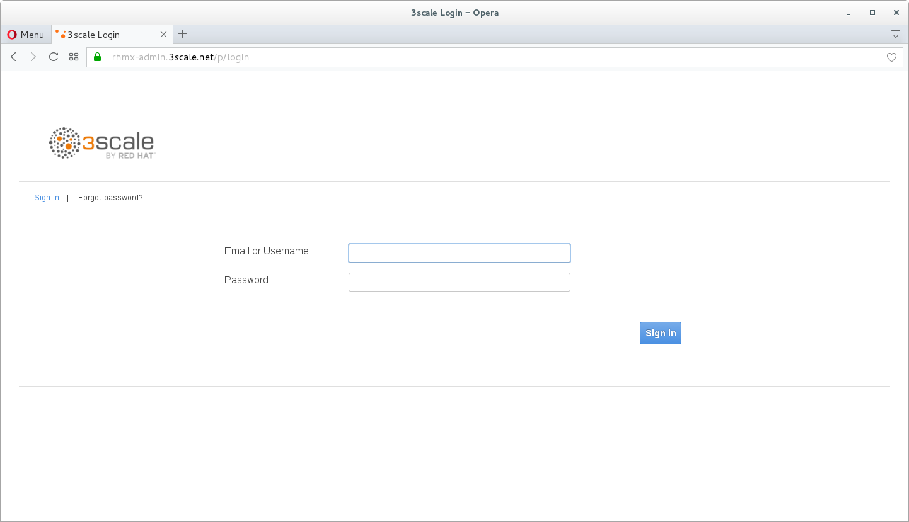
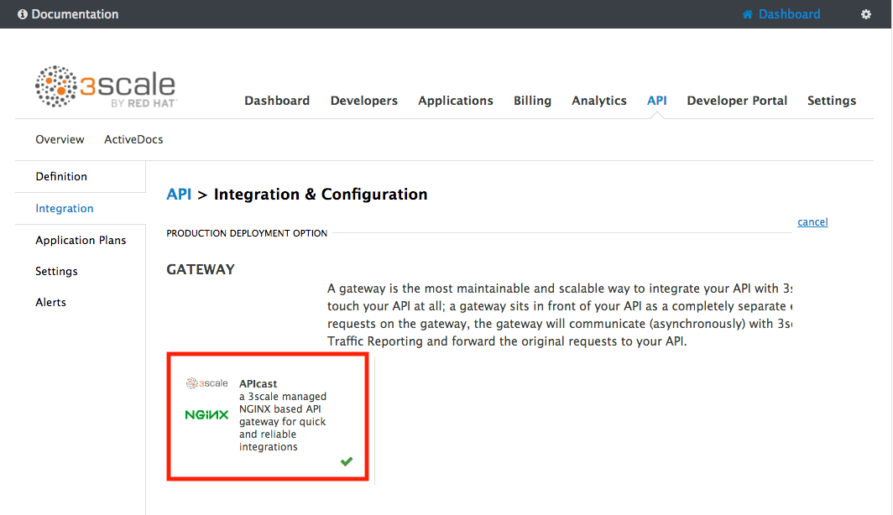
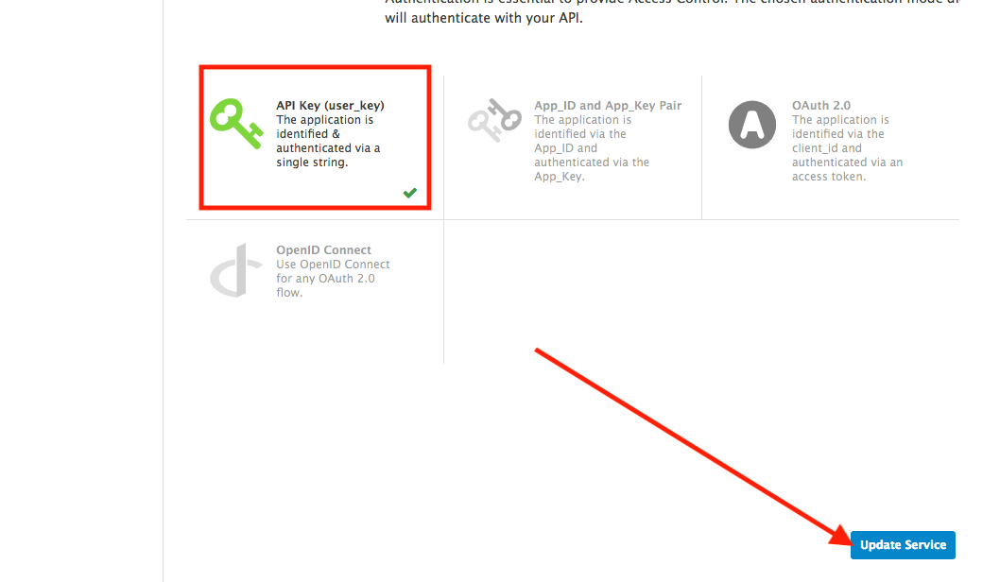
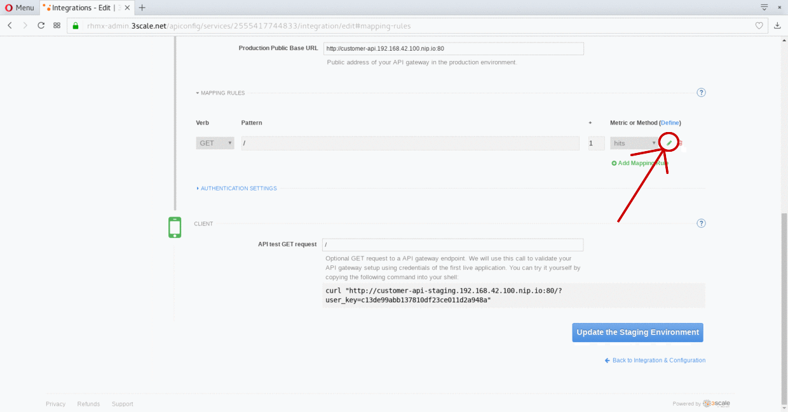
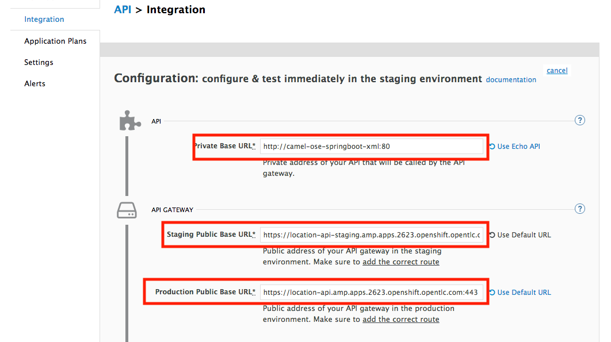

# Lab 3

## API Management

### Take control of your APIs

* Duration: 30 mins
* Audience: API Owners, Product Managers, Developers, Architects

## Overview

> Describe the general idea of the lab and what is the attendant going to learn.

### Why Red Hat?

> Add the keypoints why the attendant will find value using Red Hat products.

### Skipping The Lab

We know sometime we don't have enough time to go over step by step on the labs. So here is a short video where you can see how to configure your service using Red Hat 3scale API Management. [link](wip-link)

If you are planning to follow the next lab, here is a [link](wip-link) to the gated service endpoint.

### Environment

**URLs:**

Check with your instruction the *GUID* number of your current workshop environment. Replace the actual number on all the URLs where you find **GUID**. 

Example in case of *GUID* = **1234**: 

```bash
https://master.GUID.openshift.opentlc.com
```

becomes =>

```bash
https://master.1234.openshift.opentlc.com
```

**Credentials:**

Your username is your asigned user number. For example, if you are assigned user number **1**, your username is: 

```bash
user1
```

The password to login is always the same:

```bash
r3dh4t1!
```

## Lab Instructions

### Step 1: Define your API

Your 3scale Admin Portal provides access to a number of configuration features.

1. Open a browser window and navigate to:

    ```bash
    https://userX-admin.apps.GUID.openshift.opentlc.com/
    ```
    
    *Remember to replace the GUID with your [environment](#environment) values and your user number.*

1. Accept the self-signed certificate.

    

1. Log into 3scale using your designated [user and password](#environment). Click on **Sign In**.

    

1. If it's the first time you access the 3scale portal, dismiss and close the wizard by clicking on the top right **X**.

    

1. The first page you will land is the API tab. From here we will create our API definition. Click on the `Integration` link.

    

4. Click on the `edit integration settings` to edit the API settings for the gateway.

    

5. Select the **APIcast self-managed** Gateway deployment option.

    

6. Keep the **API Key (user_key)** Authentication.

    

7. Click on **Update Service**

8. Click on the **add the Base URL of your API and save the configuration** button

9. Expand the **mapping rules** section to define the allowed methods on our exposed API.

    > **Note:** the default mapping is the root ("/") of our API resources, something that we might want to avoid.

    

10. Click on the **Metric or Method (Define)**  link.

    

11. Click on the **New Method** link in the *Methods* section.

    

12. Fill in the information for your Fuse Method.

    **Friendly name:** `Get Customers`

    **System name:** `customers_all`

    **Description:** `Method to return all customers`

    

13. Click on **Create Method**

14. **Optional:** Add the `Get Customer` method if you followed the instructions in the previous part of this lab to search by `{id}`. Name it `customer_get`.

15. Click on the **Add mapping rule** link

    

16. Click on the edit icon next to the GET mapping rule.

    

17. Enter `/myfuselab/customer/all` as the Pattern.

18. Select `customers_all` as Method.

    

19. *Optional::* Click on the **Add Mapping Rule** button to add the `customer_get` method mapping.

20. Fill in the information for accessing your API:

    **Private Base URL:** `http://camel-ose-springboot-xml:80`

    **Staging Public Base URL:** `http://customer-api-staging.<OPENSHIFT-SERVER-IP>.nip.io:80`

    **Production Public Base URL:** `http://customer-api-production.<OPENSHIFT-SERVER-IP>.nip.io:80`

    

    > **Note:** We are using the internal API service, as we are deploying our services inside the same OpenShift cluster.

21. Scroll down to the **API Test GET request**.

22. Enter `/myfuselab/customer/all`.

> *Congratulations!* You have ...

## Steps Beyond

> So, you want more? ...

## Summary

You can now proceed to [Lab 4](lab04.md)

> Explain what the student accomplish.

## Notes and Further Reading

* [Red Hat 3scale API Management](http://microcks.github.io/)
* [Developers All-in-one 3scale install](https://developers.redhat.com/blog/2017/05/22/how-to-setup-a-3scale-amp-on-premise-all-in-one-install/)
* [ThoughtWorks Technology Radar - Overambitious API gateways](https://www.thoughtworks.com/radar/platforms/overambitious-api-gateways)


