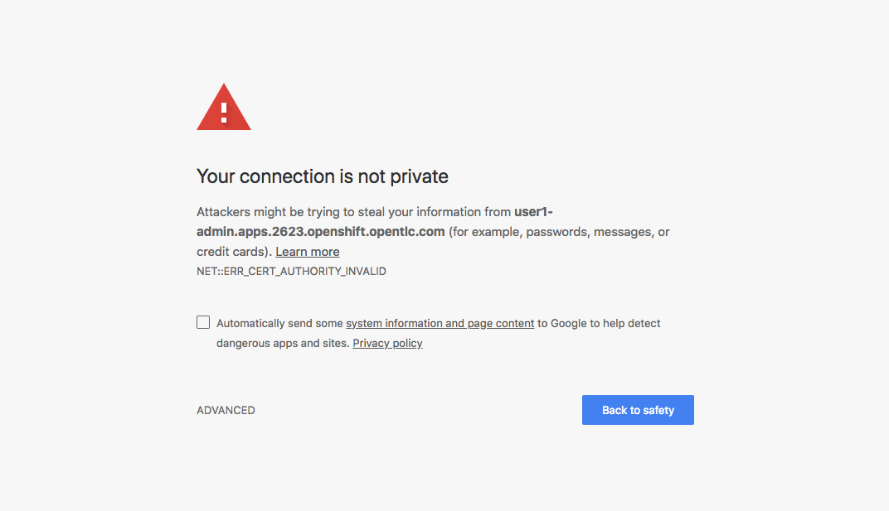
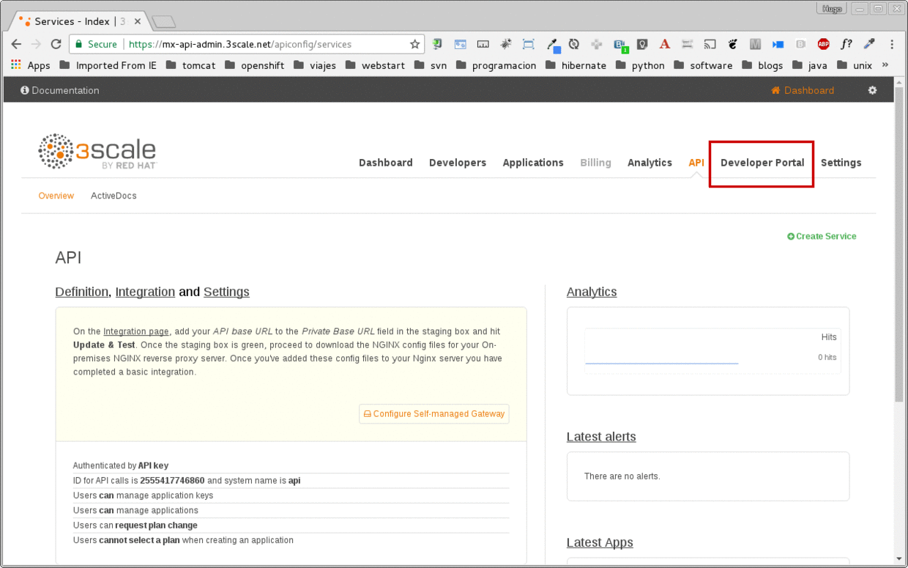
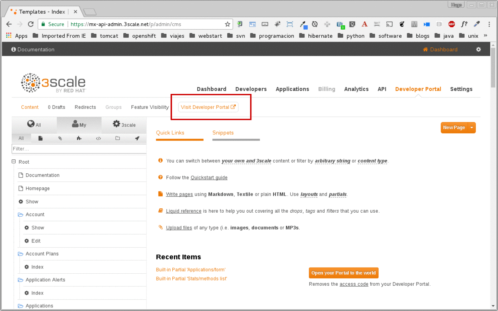
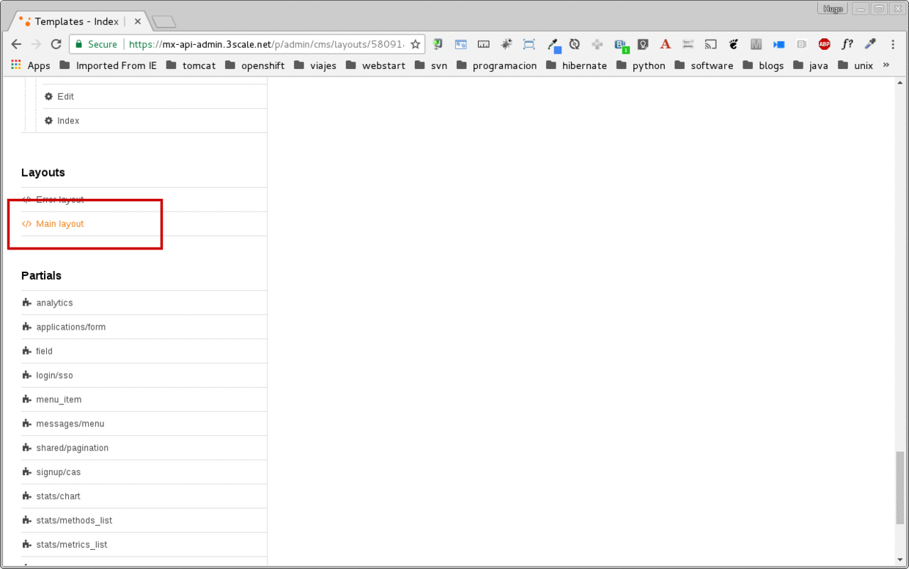
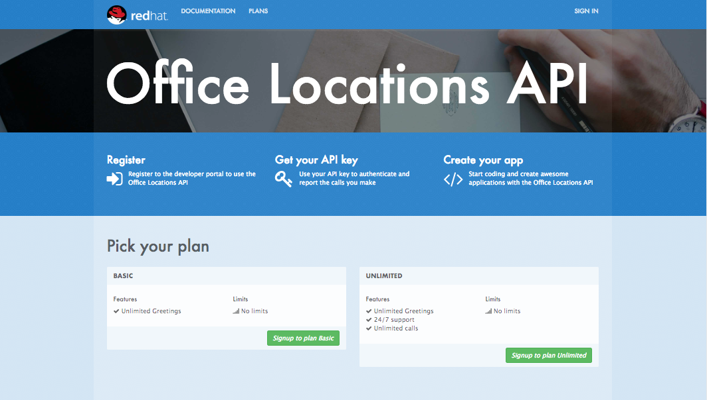
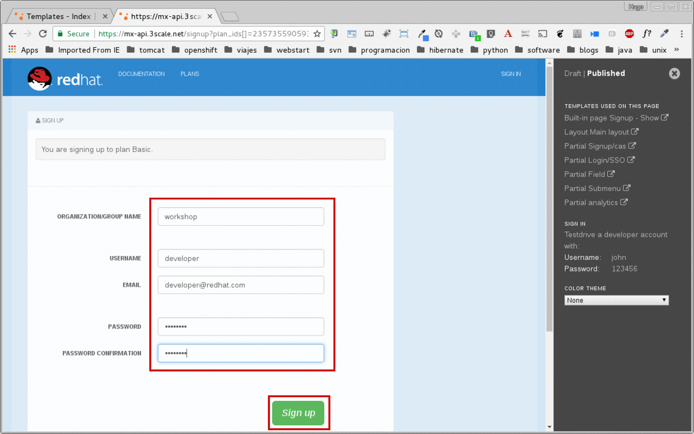
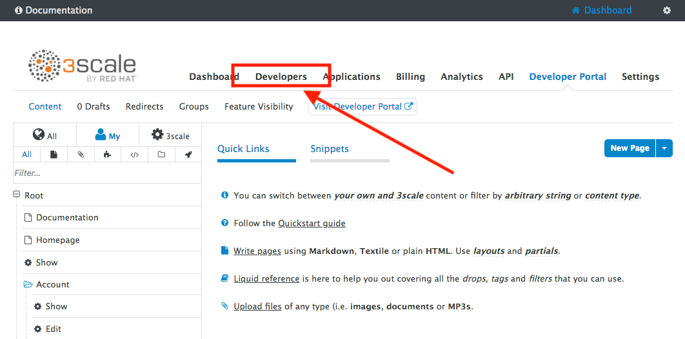
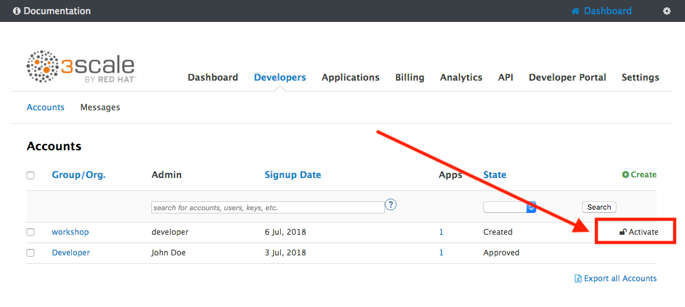
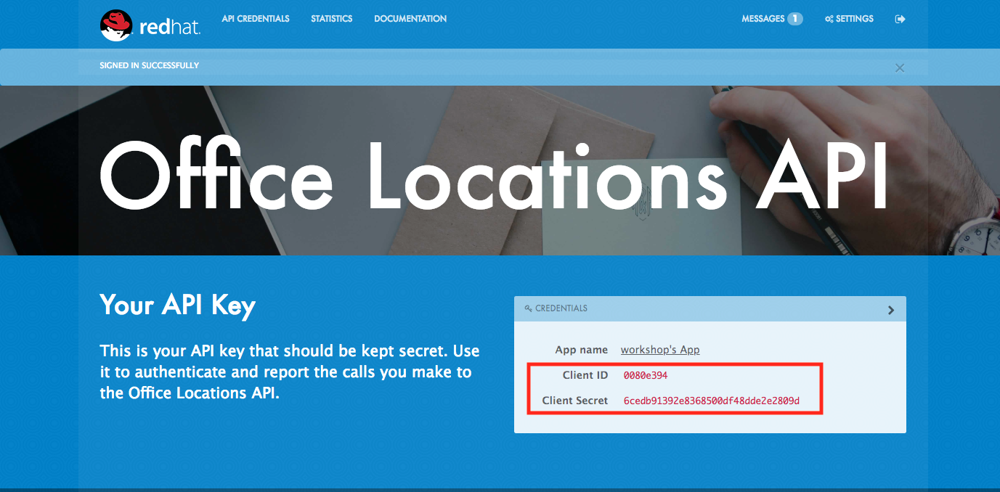

# Lab 5

## API Developers

### Publishing APIs to Developer Portal

* Duration: 20 mins
* Audience: API Owners, Product Managers, Developers, Architects

## Overview

The focal point of your developers’ experience is the API developer portal, and the level of effort you put into it will determine the level of decreased support costs and increased developer engagement.

### Why Red Hat?

3scale provides a built-in, state-of-the-art CMS portal, making it very easy to create your own branded hub with a custom domain to manage developer interactions and increase API adoption.

You can customize the look and feel of the entire Developer Portal to match your own branding. You have complete control over every element of the portal, so you can make it as easy as possible for developers to learn how to use your API.

### Environment

**URLs:**

Check with your instruction the *GUID* number of your current workshop environment. Replace the actual number on all the URLs where you find **GUID**. 

Example in case of *GUID* = **1234**: 

```bash
https://master.GUID.openshiftworkshop.com
```

becomes =>

```bash
https://master.1234.openshiftworkshop.com
```

**Credentials:**

Your username is your asigned user number. For example, if you are assigned user number **1**, your username is: 

```bash
user1
```

The password to login is always the same:

```bash
r3dh4t1!
```

## Lab Instructions

### Step 1: Customizing Developer Portal

1. Open a browser window and navigate to:

    ```bash
    https://userX-admin.apps.GUID.openshiftworkshop.com/
    ```

    *Remember to replace the GUID with your [environment](#environment) value and your user number.*

1. Accept the self-signed certificate if you haven't.

    

1. Log into 3scale using your designated [user and password](#environment). Click on **Sign In**.

    

1. Click on the **Developer Portal** tab to access the developer portal settings.

    

1. Click on the **Visit Developer Portal** to take a look of how your developer portal looks like.

    

1. You can see there is a default portal with information of your API and how to signup. Unfortunately the API information is incorrect.

    

    *We will edit our portal to update it with the correct information and we will add the cool shadowman logo*.

1. Go back to your admin portal browser tab and scroll down to the content sub-sections for the **Layouts** and select the **Main layout** menu option.

    

1. First look for the **navbar** section of the main HTML. Replace the **{{ provider.name }}** for the shadowman image link:

    ``

    

1. Click the *Publish* button at the bottom of the editor to save the changes and made them available in the site.

    

1. Go back to browse the top of the content sub-sections and find the **Homepage** section.

    

1. Change all the code **Echo** references in the homepage code for **Office Locations**.

1. Update the API call examples to reflect your real Fuse API calls.

    *Use your production base url and add your defined methods. Dont worry if you don't have the "real" output, it won't affect the rest of the lab. You can also copy and paste the [example](https://raw.githubusercontent.com/hguerrero/3scale-api-workshop/master/docs/labs/lab05/support/homepage.example) we prepared for you*.

1. Click the **Publish** button.

1. Refresh your Developer Portal's browser tab to check the changes. Your Developer Portal should now look like this:

    

### Step 2: Register New Accounts Using Developer Portal

1. Take the place of one of your developers and signup for the **Basic** plan.

    

1. Fill in your information and an email to register as a developer. Click on the **Sign up** button.

    

1. The system will try to send a message with an activation link.

    

    *Currently the lab environment doesn't have a configured email server, so we won't be able to receive the email*.

1. Go back to your *Admin Portal* tab and navigate to **Developers** to activate the new account.

    

1. Find your user under the *Accounts* and click the **Activate** link.

    

    *Your user is now active and can log into the portal*.

### Step 3: Login to Developer Portal

1. As your portal is not currently public, you will need your portal code to login. You can get the code in your admin portal navigating to: **Settings > Developer Portal > Domains &amp; Access**.

    

1. Open a new *Incognito/Private* browser window to test the Developer Portal login. Navigate to:

    ```bash
    https://userX.apps.GUID.openshiftworkshop.com/
    ```

1. Type your portal code to finish the login.

    

1. Sign in to the portal.

    

1. You will land in the developers homepage, where you will be able to check your developers settings and retrieve your newly created **Client ID** and **Client Secret**.

    

    *Copy down this credentials as it you will use them to authenticate yourself to the managed API*.

*Congratulations!* You have successfuly customized your Developer Portal and completed a Sign Up process.

## Steps Beyond

So, you want more? Click the **Documentation** link. Where does it takes you? *API Docs* is where you can add your interactive documentation for your APIs. Is based on the known *Swagger UI* interface.

You can add from the Admin Portal under *API Docs* the API definition to generate the live testing.

## Summary

In this lab you discovered how to add a developer facing experience to your APIs. Developers in your organization or outside of it can now register, gain access to API keys and develop sample applications.

You can now proceed to [Lab 6](../lab06/#lab-6)

## Notes and Further Reading

Red Hat 3scale Developer Portal's CMS consists of a few elements:

* Horizontal menu in the Admin Portal with access to content, redirects, and changes
* The main area containing details of the sections above
* CMS mode, accessible through the preview option


[Liquid](https://github.com/Shopify/liquid) is a simple programming language used for displaying and processing most of the data from the 3scale system available for API providers. In 3scale, it is used to expose server-side data to your API developers, greatly extending the usefulness of the CMS while maintaining a high level of security.

### Links

* [Developer Portal Documentation](https://access.redhat.com/documentation/en-us/red_hat_3scale/2.2/html/developer_portal/)
* [Liquid markup language](https://github.com/Shopify/liquid)
* [And Overview of Liquid](https://www.shopify.com/partners/blog/115244038-an-overview-of-liquid-shopifys-templating-language)
