# Lab 6

## API Consumption

### Connect Applications and APIs

* Duration: 15 mins
* Audience: API Consumers, Developers, Architects

### Overview

APIs provide the building blocks for applications, but it is applications which deliver functionality to the end users. hence to see APIs in action it helps to see how applications can call APIs to provide new functionality. In this lab you'll be able to create a simple web application which consumes the API you built earlier ojn in the exercises.  

### Why Red Hat?

Applications can be built from many technologies. In this case we use a simple web application, but a wide range of Red Hat and non-Red Hat technologies could be used.

### Skipping The Lab

If you decide to skip the lab you can check how a SSO enabled web applications looks like:

```bash
http://www-international.apps.GUID.openshiftworkshop.com
```

### Environment

**URLs:**

Check with your instruction the *GUID* number of your current workshop environment. Replace the actual number on all the URLs where you find **GUID**.

Example in case of *GUID* = **1234**:

```bash
https://master.GUID.openshiftworkshop.com
```

becomes =>

```bash
https://master.1234.openshiftworkshop.com
```

**Credentials:**

Your username is your asigned user number. For example, if you are assigned user number **1**, your username is:

```bash
user1
```

The password to login is always the same:

```bash
openshift
```

## Lab Instructions

### Step 0: Setup the collaboration environment using Git (Gogs)

For this lab we require a collaboration environment based on Git. You can use GitHub, GitLab or other Git provider to finish this lab. If you don't want to use your personal account, the provided lab environment has an user provided for you in Gogs.

Follow this instructions to set up the repository.

1. Open a browser window and navigate to:

    ```bash
    http://gogs.apps.GUID.openshiftworkshop.com/user/login?redirect_to=
    ```

1. Log into Gogs using your designated [user and password](#environment). Click on **Sign In**.

    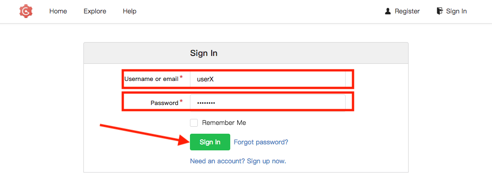

1. In the main page, click in the **+** sign in the right top corner to display the *New* menu. Click the **New Migration** option.

    

1. Fill in the information of the repository migration with the following values:

    * Clone Address: **https://github.com/hguerrero/3scaleworkshop-wwwpage.git**
    * Owner: **UserX**
    * Repository Name: **www-page**

    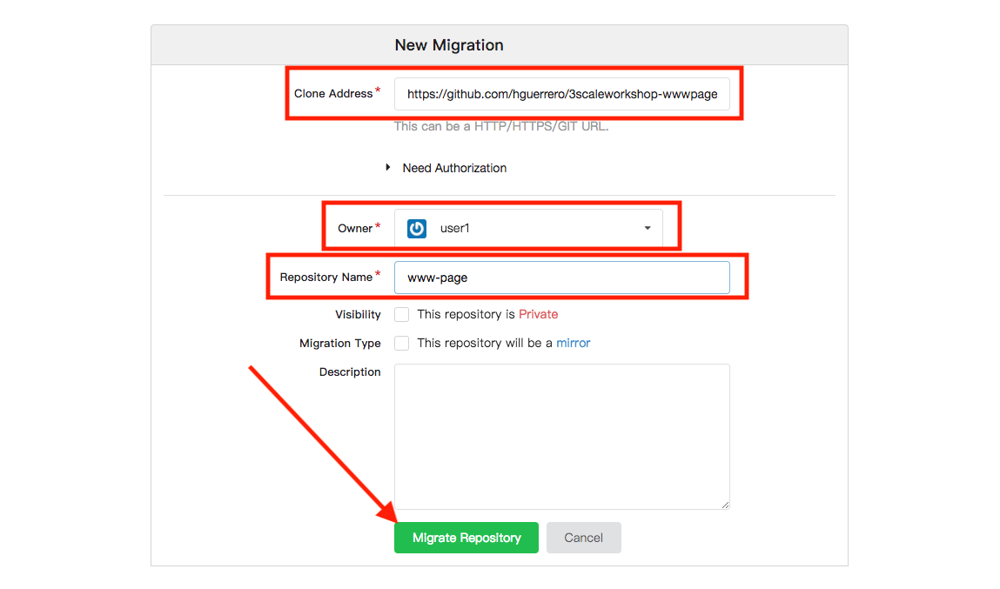

1. Click on **Migrate Repository** to fork the GitHub repo into Gogs.

    *You now have a working copy of the International Inc Web page. If you know how to, clone the repository to work locally, or you can continue working using Gogs online editor*.

### Step 1: Deploying International Inc Web Page

International Inc web development create a Node.js application for the company home page. They added a map service to locate the offices around the world. In this step you will deploy that application.

1. Open a browser window and navigate to:

    ```bash
    https://master.GUID.openshiftworkshop.com/console
    ```

    *Remember to replace the GUID with your [environment](#environment) value and your user number.*

1. Accept the self-signed certificate if you haven't.

    

1. Log into OpenShift using your designated [user and password](#environment). Click on **Sign In**.

    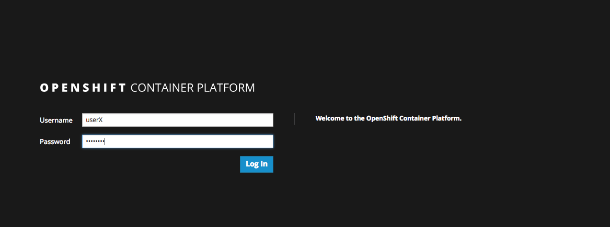

1. You are now in OpenShift's main page. Click on your **userX** project in the right side of the screen.

    

1. From your main project page, click **Browse Catalog**.

    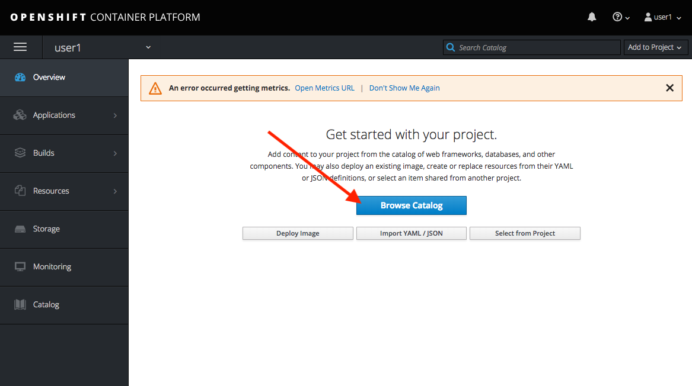

1. Scroll down the page and search for the **Node.js** template. Click on the link.

    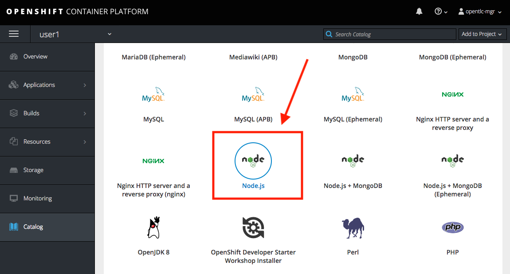

1. Click the **Next >** button.

    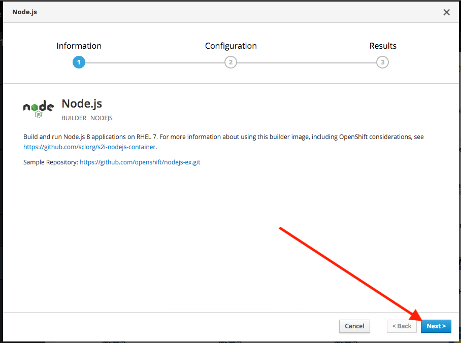

1. Fill in the configuration information with your API implementation github repo details:

    * Application Name: **www**
    * Git Repository URL: **http://gogs.apps.GUID.openshiftworkshop.com/userX/www-page.git**

    *Remember to replace the GUID with your [environment](#environment) value and your user number*.

    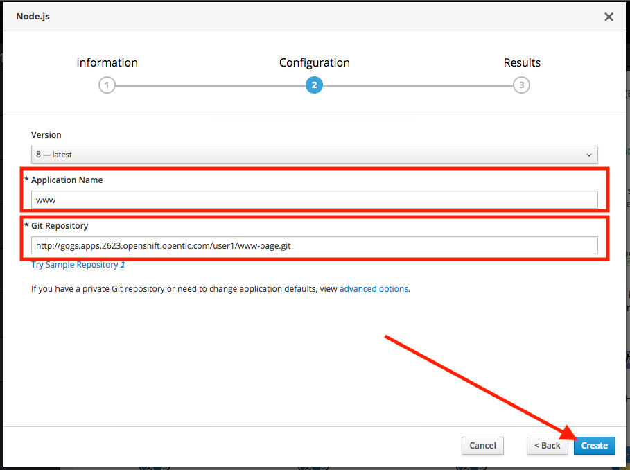

1. Click **Create**.
  
1. Your service will be provisioned in a moment. Click the **Continue to the project overview** link.

    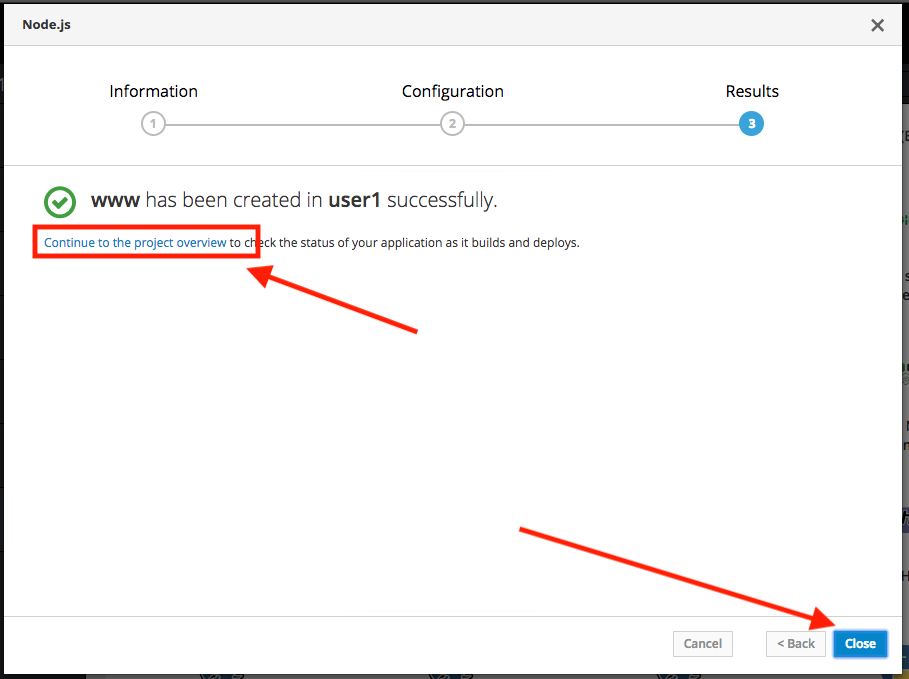

    _If you clicked the **Close** button, click **Overview** in the left side menu to review the deployment status_.

1. From your overview page, click the white space next to the **www** link to expand the deployment information.

    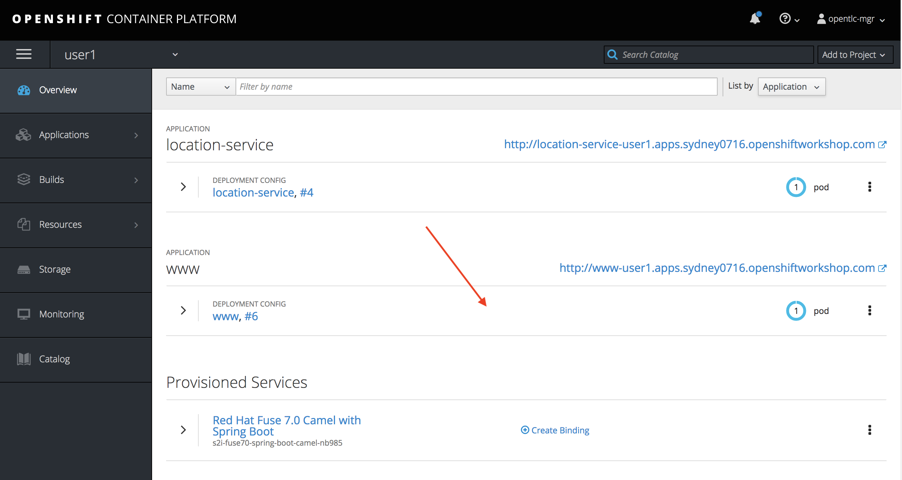

1. Scroll down and click in the **www** link in the *BUILDS* section.

    

1. In the build configuration page, change to the **Environment** tab. Fill in the available row with the following information:

    * Name: **API\_BACKEND\_URL**
    * Value: **http://location-service-userX.apps.GUID.openshiftworkshop.com/locations**

    *Remember to replace the GUID with your [environment](#environment) value and your user number*.

    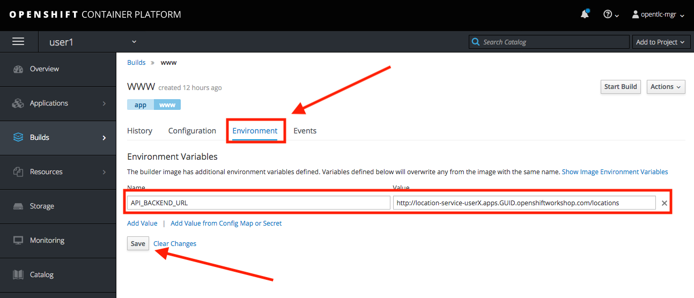

    _Click the **Add Value** link to enable a new row if not already present_.

1. Click **Save** button to persist the changes. A green pop up will show you that the changes were saved.

1. Click the **Start Build** button to trigger a new build using the new environment variables pointing to your service.

    

1. Click the **Overview** menu option on the left side to go back to the your project overview page.

1. In the overview page, wait until the running *Build is complete* and the pod circle stays blue continously. This means the application was successfully deployed and now is ready to listen to requests.

    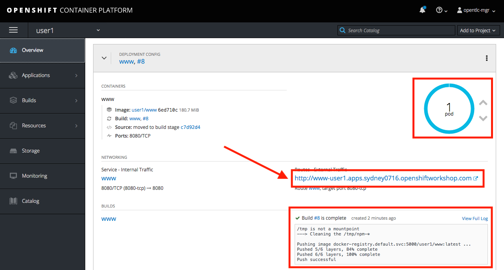

1. Click the **Routes - External Traffic** to open a new tab and connect to *International Inc* new website.

1. You should now see what the development team created for International Inc. Click **LOCATIONS** to check the locations page.

    

1. This pages uses the unsecured Location API service. It displays the different International Inc offices around the world.

    

1. In the next step we will update the Locations page to use the 3scale protected API.

### Step 2: Calling a Secured Service with Red Hat Single Sign On

In this step, we will edit the code provided by development to add keycloak. Keycloak is the upstream project powering Red Hat Single Sign On. The Keycloack Javascript Adapter simplifies the required code to interact with the OpenID Connect authentication flows.

1. Go back to your Git repository and navigate to **dev** folder.

    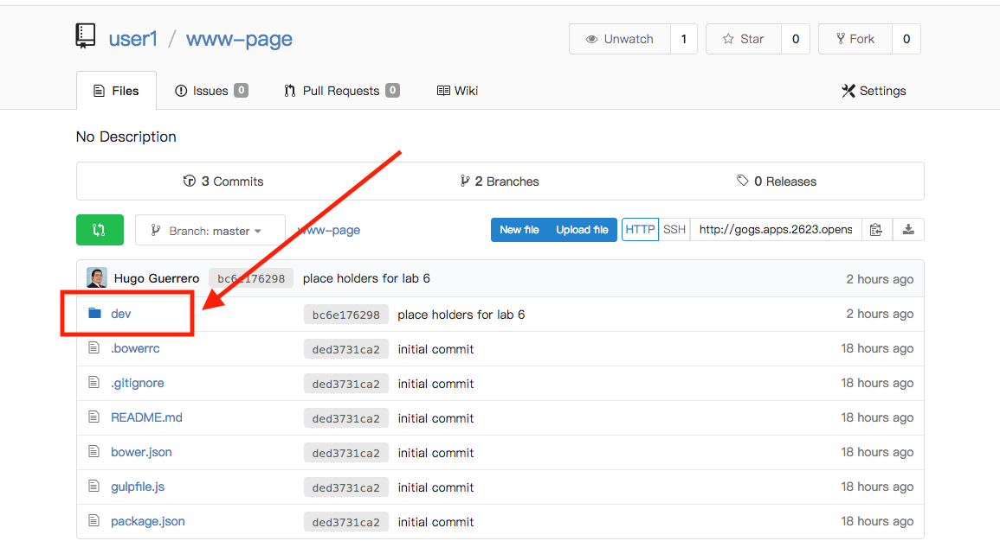

1. Click on the **locations.html** link to open the file.

    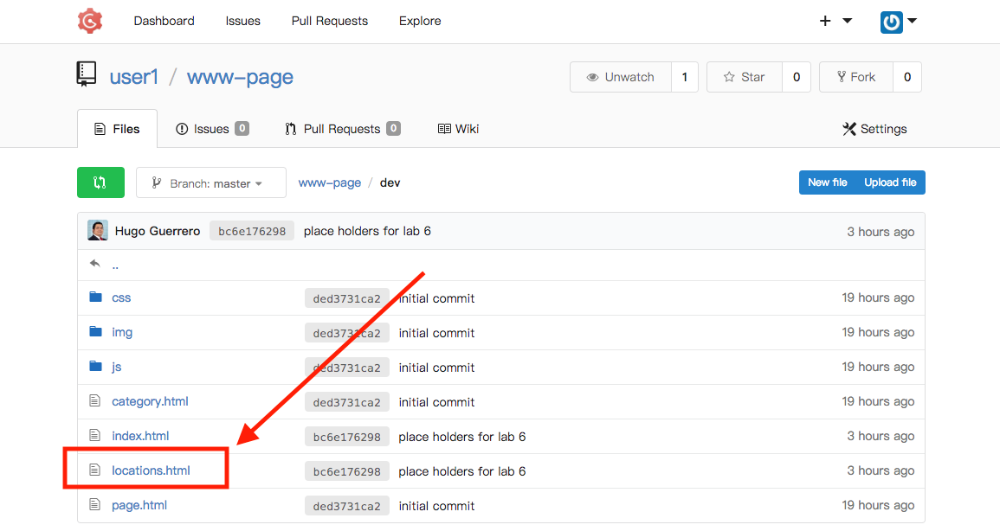

1. Change to *edit* mode clicking on the pencil icon on the right side. 

    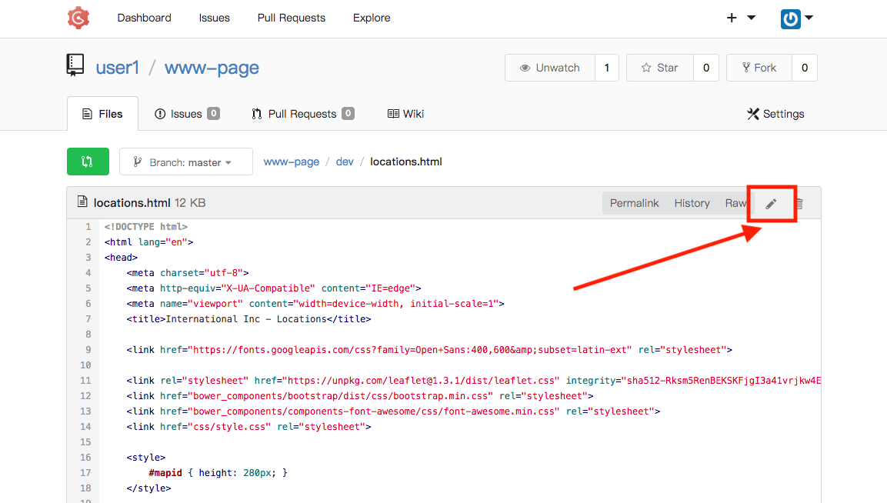

1. Scroll down the page an look for the following code:

    ```bash
    <!-- Keycloak Adapter Start-->

    <!-- Keycloak Adapter End -->
    ```

1. Import the Javascript Adapter library by pasting between the previous markers the following code:

    ```bash
    <script src="SSO_URL/auth/js/keycloak.js"></script>
    ```
1. Continue scrolling down until you find the next markers:

    ```bash
    <!-- Keycloak Login Start -->

    <!-- Keycloak Login End -->
    ```

1. Here we will add a **Login** button so users can start the Authentication Flow. It will disapear and be replaced with the map when user is logged in. Paste between the markers the following code:

    ```bash
    <p><a id="loginUrl" href="#" class="btn btn-primary">Sign In to access the Location API Service</a></p>
    ```

1. Continue scrolling down until you find the next markers:

    ```bash
    // Keycloak Config Start

    callService(mymap)

    // Keycloak Config End
    ```

1. Replace the code between the markers with the following snippet:

    ```bash
    var keyOptions = {
        url: 'SSO_URL/auth',
        realm: 'SSO_REALM',
        clientId: 'CLIENT_ID'
    };

    var keycloak = Keycloak(keyOptions);
    keycloak.init({ onLoad: 'check-sso' }).success(function (authenticated) {
        if (authenticated) {
            $("<h4>Welcome " + keycloak.idTokenParsed.preferred_username + "</h4> ").insertBefore($('#mapid'));
            callService(mymap, keycloak.token);
            $('#mapid').show();
            $('#loginUrl').hide();
        }
        else {
            $('#mapid').hide();
            $('#loginUrl').show();
        }
    }).error(function (data) {
        alert('Failed to initialize keycloak: ' + data);
    });

    var opts = {
        redirectUri: window.location.origin + "/locations.html"
    };

    var loginUrl = keycloak.createLoginUrl(opts);
    document.getElementById('loginUrl').href = loginUrl;
    ```

    *Remember to replace CLIENT_ID with the one you got in the [API Security Lab](../lab04/#step-4-create-a-test-app), it should look like `clientId: 'e343da3'`*.

1. Continue scrolling down until you find the next markers:

    ```bash
    /* Keycloack Params Start*/

    /* Keycloak Params End */
    ```

1. Paste between the markers the following code:

    ```bash
    , token
    ```

1. Finally the last marker:

    ```bash
    // Keycloak Ajax Start

    // Keycloak Ajax End
    ```

1. Paste between markers the last snippet:

    ```bash
    // Keycloak Ajax Start
    headers: {
         'Authorization': 'Bearer ' + token
    },
    // Keycloak Ajax End
    ```

1. Scroll to the bottom of the page. Update the *Commit Changes* inputs and click **Commit Changes** to save your work.

    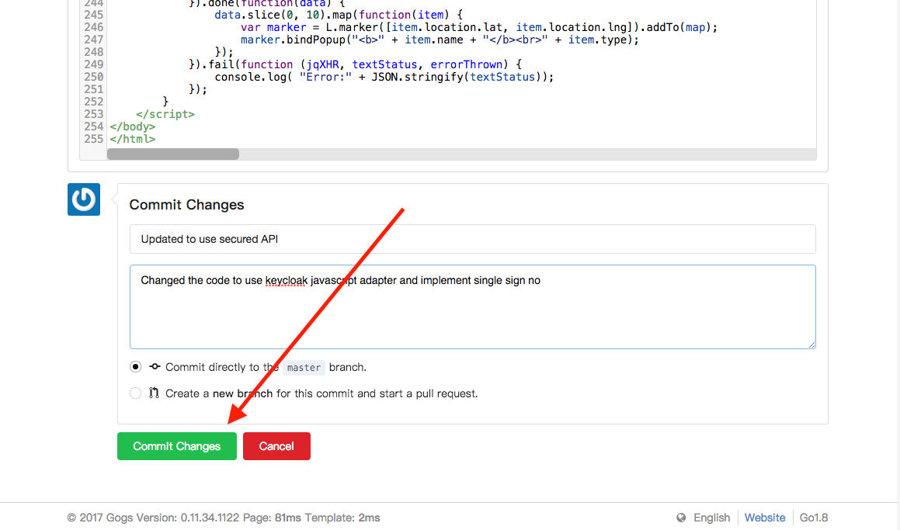

1. Because we are using self signed certificates, you will need to accept the certificate for the secured endpoint. Open a new browser tab or window and navigate to:

    ```bash
    https://location-userX-api-staging.amp.apps.GUID.openshiftworkshop.com/locations
    ```

    *Remember to replace the GUID with your [environment](#environment) value and your user number*.

1. Accept the self-signed certificate if you haven't.

    

1. You will see that your call succeded if you see the following text in your browser:

    ```bash
    Authentication parameters missing
    ```

### Step 3: Update Red Hat Single Sign On Application Callback

Redirect URLs are a critical part of the OAuth flow. After a user successfully authorizes an application, the authorization server will redirect the user back to the application with either an authorization code or access token in the URL. Because the redirect URL will contain sensitive information, it is critical that the service doesn’t redirect the user to arbitrary locations.

1. Open a browser window and navigate to:

    ```bash
    http://sso-rh-sso.apps.GUID.openshiftworkshop.com/auth/admin/userX/console/
    ```

    *Remember to replace the GUID with your [environment](#environment) value and your user number.*

1. Log into Red Hat Single Sign On using your designated [user and password](#environment). Click on **Sign In**.

    

1. Select **Clients** from the left menu.

    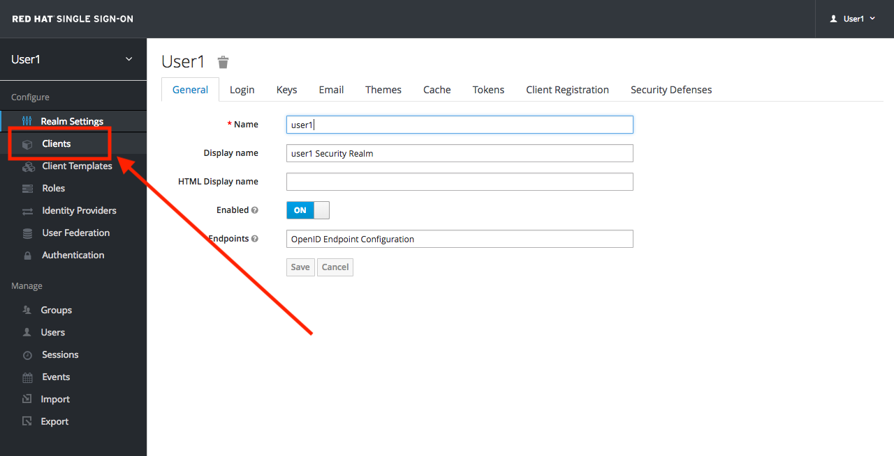

    *3scale, through it's zync component, already synchronized the application information into the Red Hat SSO security realm*.

1. Click on the **CLIENT_ID** link to view the details.

    

    *Remember to replace CLIENT_ID with the one you got in the [API Security Lab](../lab04/#step-4-create-a-test-app). It will easily identificable as its and hexadecimal name*.

1. Scroll down, type in and select the following options in the application configuration:

    * Access Type: **Public**
    * Standard Flow Enabled: **ON**
    * Implicit Flow Enabled: **OFF**
    * Valid Redirect URIs: **[http://www-userX.apps.GUID.openshiftworkshop.com/*](http://www-userX.apps.GUID.openshiftworkshop.com/*)**
    * Web Origins: **\***

    *Remember to replace the GUID with your [environment](#environment) value and your user number.*

    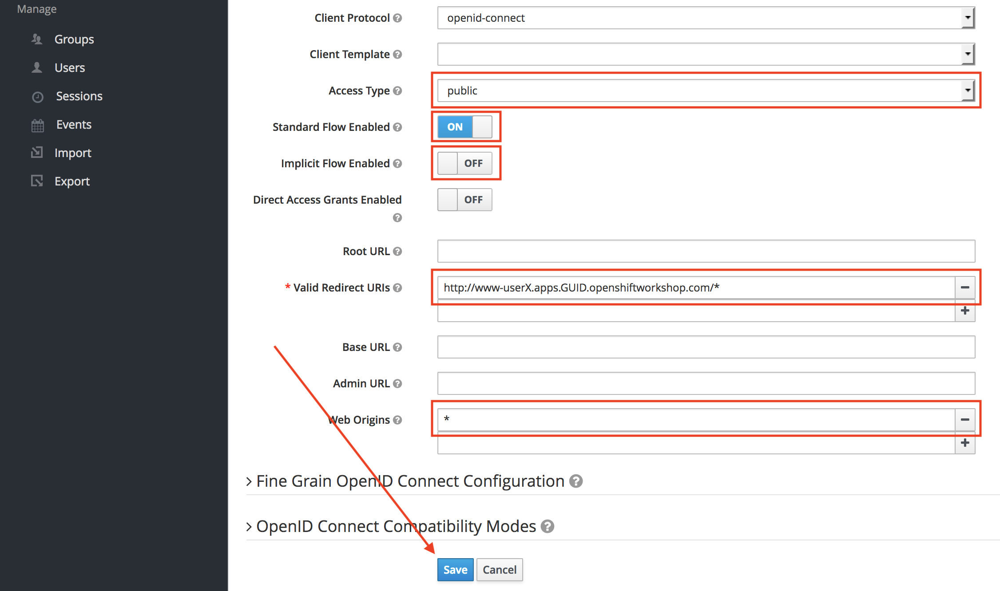

1. Finally, click **Save** button to persist the changes.

### Step 4: Updating OpenShift Deployment

OpenShift let you automatically redeploy your changes when you setup a Continuous Integration / Continuous Deployment (CI/CD) pipeline through the use of webhook. For this lab we will trigger the new build and deployment manually through the OpenShift Console.

1. Go back to your OpenShift web console. Navigate to your project's overview page.

1. Scroll down and click in the **www** link in the *BUILDS* section.

    

1. In the build configuration page, change to the **Environment** tab. 

1. **Replace** the unprotected endpoint URL with the new value of your 3scale-protected Location Service API URL. Also add this new two environment variables **SSO_URL** and **SSO_REALM**.

    * Name: **API\_BACKEND\_URL**
    * Value: **https://location-userX-api.amp.apps.GUID.openshiftworkshop.com/locations**
    * Name: **SSO\_URL**
    * Value: **http://sso-rh-sso.apps.GUID.openshiftworkshop.com**
    * Name: **SSO\_REALM**
    * Value: **userX**

    _Click **Add Value** to add additional rows_.

    *Remember to replace the GUID with your [environment](#environment) value and your user number*.

    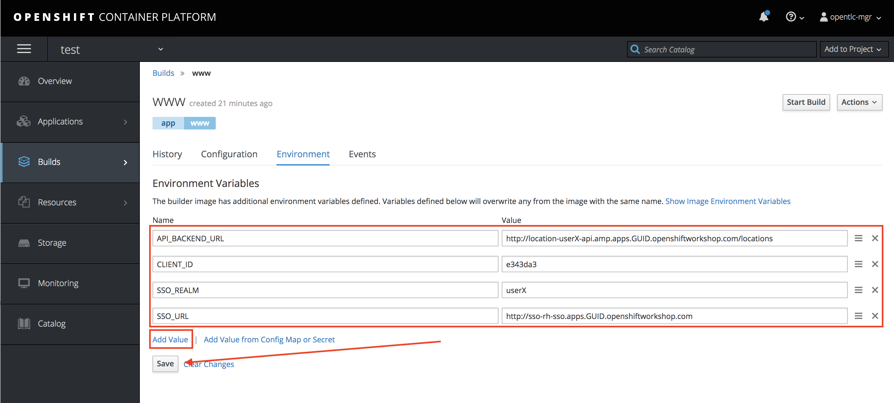

1. Click **Save** button to persist the changes. A green pop up will show you that the changes were saved.

1. Click the **Start Build** button to trigger a new build using the new environment variables pointing to your service.

    

1. A new build will be triggered. Expand the row by clicking the **Builds** Icon.

    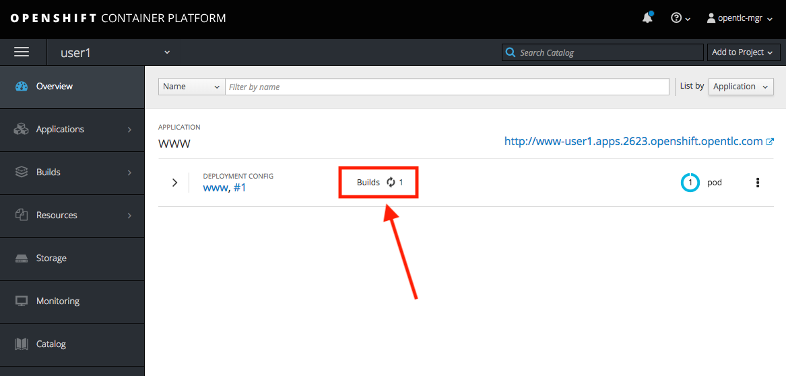

    *The build process checks out the code from the git repo, runs a source-to-image container image build, and redeploys the container with the new image using a rolling upgrade strategy*.

1. Wait for until the new **Build to complete** and the rolling upgrade to finish to test your new deployment.

    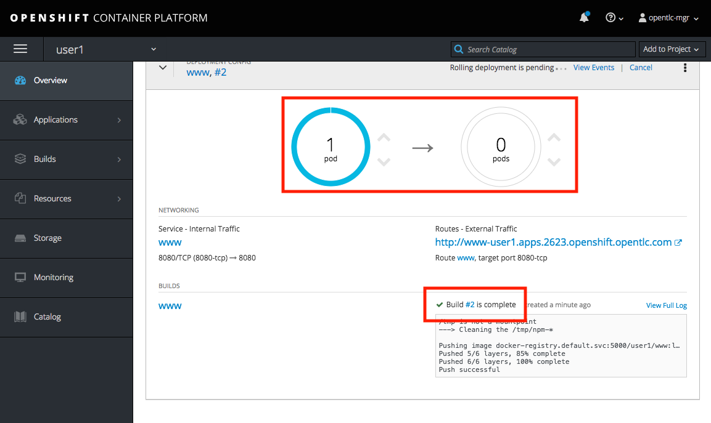

1. Refresh the browser tab where you opened the International Inc web page or click the route URL to check out the changes.

    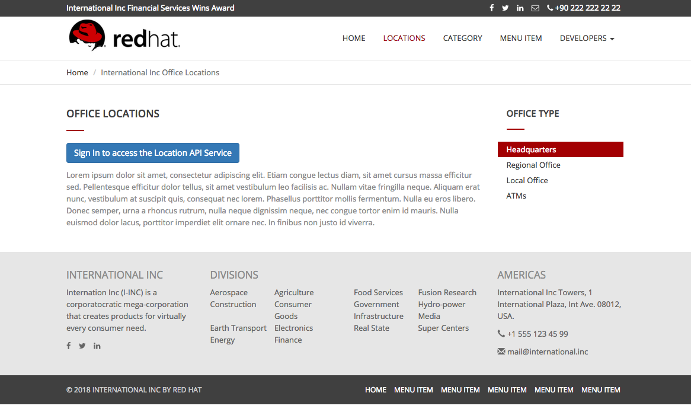

    _You can notice now the **Sign In** button in the page_.

### Step 5: Test the Single Sign On Integration

1. Let's test the integration. Click the **Sign In** button.

1. You are being redirected to Red Hat Single Sign On **Login Page**. Login using the user credentials you created in the [API Security Lab](../lab04/#step-2-add-user-to-realm)

    * Username: **apiuser**
    * Password: **apipassword**

    

1. You will be redirected again to the **LOCATIONS** page where now you will be able to see the map with the International Inc Offices.

    

 *Congratulations!* You have successfully used the Keycloak Javascript Adapter to protect International Inc's Locations Service with Single Sign On.

## Steps Beyond

So, you want more? You can explore in detail the documentation on the Javascript Adapter to check what other things can you get from your authenticated user.

## Summary

In total you should now have been able to follow all the steps from designing and API, deploying it's code, issuing keys, connecting OpenID connect and calling it from an application. This gives you a brief overview of the creation and deployment of an API. There are many variations and extensions of these general principles to explore!

This is the last lab of this workshop.

## Notes and Further Reading

* [Red Hat 3scale API Management](http://microcks.github.io/)
* [Setup OIDC with 3scale](https://developers.redhat.com/blog/2017/11/21/setup-3scale-openid-connect-oidc-integration-rh-sso/)
